# Windows-basic-commands-batchscript
Ex08-Windows-basic-commands-batchscript

# AIM:
To execute Windows basic commands and batch scripting

# DESIGN STEPS:

### Step 1:

Navigate to any Windows environment installed on the system or installed inside a virtual environment like virtual box/vmware 

### Step 2:

Write the Windows commands / batch file . Save each script in a file with a .bat extension. Ensure you have the necessary permissions to perform the operations. Adapt paths as needed based on your system configuration.
### Step 3:

Execute the necessary commands/batch file for the desired output. 


# WINDOWS COMMANDS:
## Exercise 1: Basic Directory and File Operations
Create a directory named "my-folder"
```
mkdir my-folder
```
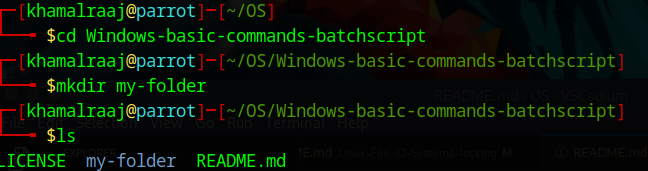

## COMMAND AND OUTPUT

Remove the directory "my-folder"
```
rmdir my-folder
```


## COMMAND AND OUTPUT


Create the file Rose.txt
```
touch Rose.txt
```
 

## COMMAND AND OUTPUT


Create the file hello.txt using echo and redirection
```
echo "hello world" > hello.txt

```
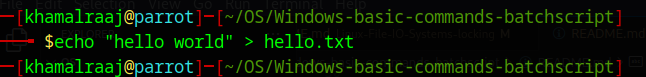

## COMMAND AND OUTPUT

Copy the file hello.txt into the file hello1.txt
```
cp hello.txt hello1.txt
```
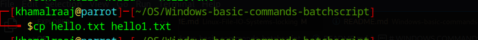

## COMMAND AND OUTPUT

Remove the file hello1.txt
```
rm hello1.txt
```

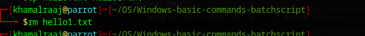

## COMMAND AND OUTPUT

List out the file hello1.txt in the current directory
```
ls hello1.txt
```
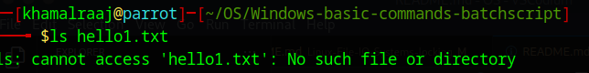

## COMMAND AND OUTPUT

List out all the associated file extensions 
```
find . -maxdepth 1 -type f
```
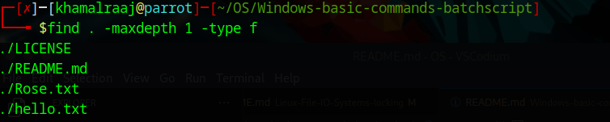

## COMMAND AND OUTPUT


Compare the file hello.txt and rose.txt
```
diff hello.txt Rose.txt
```
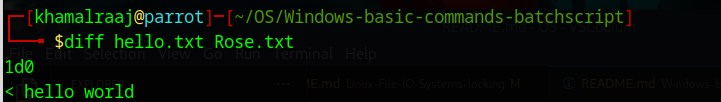


## Exercise 2: Advanced Batch Scripting
Create a batch file named on the desktop. The batch file need to have a variable assigned with a desired name for ex. name="John" and display as "Hello, John".

nano hello.sh
```
#!/bin/bash

name="John"

echo "Hello, $name"
```


## OUTPUT
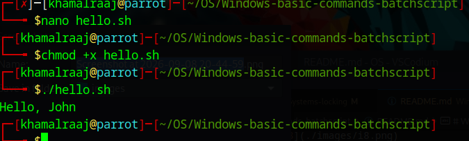


Create a batch file  on the desktop that checks whether a user-input number is odd or not. The script should:
Prompt the user to enter a number.
Calculate the remainder when the number is divided by 2.
Display whether the number is odd or not.
Ask the user if they want to check another number.
Repeat the process if the user enters Y, and exit with a thank-you message if the user enters N.
Handle invalid inputs for the continuation prompt (Y/N) gracefully.

nano odd.sh
```
#!/bin/bash

while true
do
    read -p "Enter a number: " num

    remainder=$((num % 2))

    if [ $remainder -ne 0 ]
    then
        echo "$num is odd."
    else
        echo "$num is not odd."
    fi

    while true
    do
        read -p "Do you want to check another number? (Y/N): " choice

        case $choice in
            Y|y)
                break
                ;;
            N|n)
                echo "Thank you!"
                exit 0
                ;;
            *)
                echo "Invalid input. Please enter Y or N."
                ;;
        esac
    done
done
```

## OUTPUT

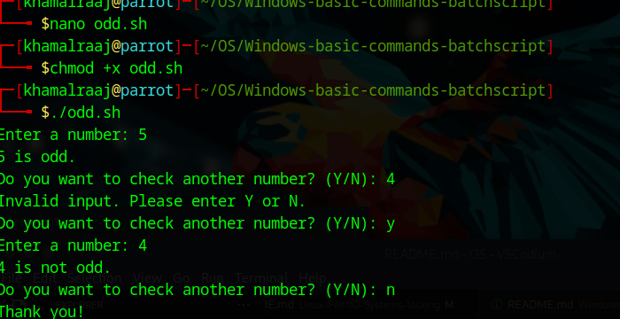


Write a batch file that uses a FOR loop to iterate over a sequence of numbers (1 to 5) and displays each number with the label Number:. The output should pause at the end.


nano numbers.sh

```
#!/bin/bash

for i in {1..5}
do
    echo "Number: $i"
done

read -p "Press Enter to continue..."
```


## OUTPUT

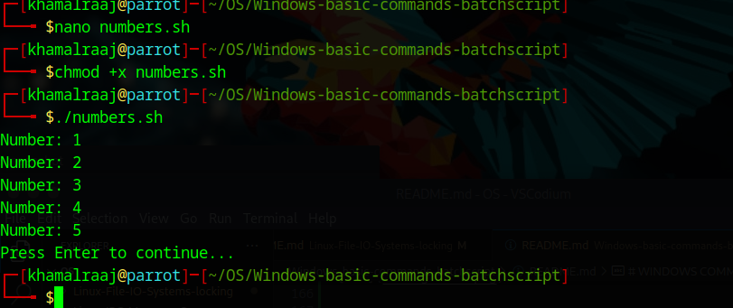


Write a batch script to check whether a file named sample.txt exists in the current directory. If the file exists, display the message sample.txt exists. Otherwise, display sample.txt does not exist. Pause the script at the end to view the result.

Instructions:
Use the IF EXIST conditional statement.
Make sure the script works for files located in the same directory as the batch file.
Use pause to keep the command window open after displaying the message.
Expected Output (if the file exists):

nano checkfile.sh
```
#!/bin/bash

if [ -f "sample.txt" ]
then
    echo "sample.txt exists."
else
    echo "sample.txt does not exist."
fi

read -p "Press Enter to continue..."
```

## OUTPUT
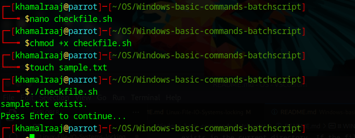

Write a batch script that displays a simple menu with three options:
Say Hello – Displays the message Hello, World!
Create a File – Creates a file named newfile.txt with the content This is a new file
Exit – Exits the script with a goodbye message
The script should repeatedly display the menu until the user chooses to exit. Use goto statements to handle menu navigation.

nano menu.sh
```
#!/bin/bash

while true
do
    clear

    echo "=========================="
    echo "        MAIN MENU"
    echo "=========================="
    echo "1. Say Hello"
    echo "2. Create a File"
    echo "3. Exit"
    echo "=========================="

    read -p "Enter your choice: " choice

    case $choice in
        1)
            echo "Hello, World!"
            read -p "Press Enter to continue..."
            ;;

        2)
            echo "This is a new file" > newfile.txt
            echo "newfile.txt has been created."
            read -p "Press Enter to continue..."
            ;;

        3)
            echo "Goodbye!"
            exit 0
            ;;

        *)
            echo "Invalid choice. Please try again."
            read -p "Press Enter to continue..."
            ;;
    esac
done
```
## OUTPUT
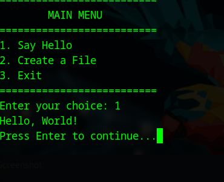


# RESULT:
The commands/batch files are executed successfully.

